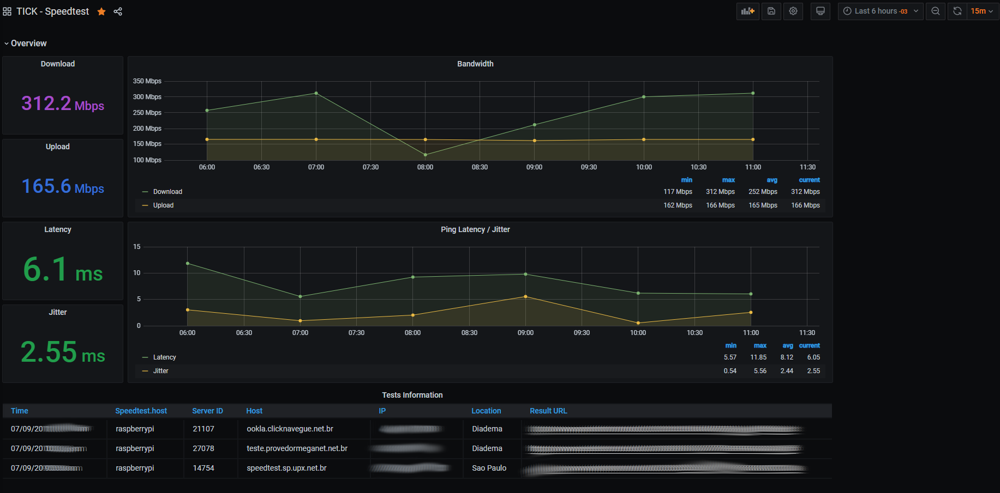

### Configuring the repositories

1. Influx Repository

   ```bash
   wget -qO- https://repos.influxdata.com/influxdb.key | sudo apt-key add -
   source /etc/os-release
   echo "deb https://repos.influxdata.com/debian $(lsb_release -cs) stable" | sudo tee /etc/apt/sources.list.d/influxdb.list
   ```

2. Grafana

   ```bash
   sudo apt-get install -y apt-transport-https dirmngr gnupg1 
   sudo apt-get install -y software-properties-common wget
   wget -q -O - https://packages.grafana.com/gpg.key | sudo apt-key add -
   
   ## Stable OSS Repository
   echo "deb https://packages.grafana.com/oss/deb stable main" | sudo tee -a /etc/apt/sources.list.d/grafana.list 
   
   ## Beta OSS Repository
   echo "deb https://packages.grafana.com/oss/deb beta main" | sudo tee -a /etc/apt/sources.list.d/grafana.list
   ```

3. Speedtest

   ```bash
   sudo apt-key adv --keyserver keyserver.ubuntu.com --recv-keys 379CE192D401AB61
   echo "deb https://ookla.bintray.com/debian $(lsb_release -sc) main" | sudo tee  /etc/apt/sources.list.d/speedtest.list
   ```

### Installing the TICK stack and Grafana

1. Install

   ```bash
   sudo apt clean all
   sudo apt update
   sudo apt install influxdb telegraf chronograf grafana speedtest
   ```

   

2. Auto start on startup

   ```bash
   sudo systemctl enable {grafana-server,influxdb,telegraf}
   ```

### Configuration

------
1. **InfluxDB**

   1.1 You need to edit the `/etc/influxdb/influxdb.conf`

   1.2 You can use your on configuration our this [influxdb.conf](config/influxdb.conf).

   **Note**: This configuration file is very simple and should be revised to work with your environment.  

   1.3 After editing you gonna need restart the service InfluxDB

   ```bash
   sudo systemctl enable influxdb
   ```
	
1. **Telegraf**

   1.1 You need to edit the `/etc/telegraf/telegraf.conf`

   1.2 You can use your on configuration our this [telegraf.conf](config/telegraf.conf).

   If you user your config, you gonna need to add un `[[inputs.exec]]`, as following, this will execute the speedtest-cli, with 60minutes interval, and return a JSON and store it in your configured `[[outputs.influxdb]]`.

   ```properties
   [[inputs.exec]]
   commands = ["/usr/bin/speedtest -f json-pretty"]
   name_override = "Speedtest"
   timeout = "5m"
   interval = "60m"
   data_format = "json"
   json_string_fields = [
     "host",
     "interface_externalIp",
     "server_name",
     "server_id",
     "server_location",
     "server_host",
     "server_ip",
     "result_url"
     ]
   ```

1. **Grafana**

   3.1 Configuring Grafana Server to run on port 80

   3.2 Edit `/etc/grafana`, uncomment the line http_port = 3000 and change to http_port = 80

   3.3 Allow the binary to run in port 80 

   ```bash
   sudo setcap 'cap_net_bind_service=+ep' /usr/sbin/grafana-server
   ```

   **Note**: This command need to be executed every time that you update your grafana.

   3.4 Configure the InfluxDB datasource.

   3.5 Import the dashboard [TICK - Speedtest-External](dashboard/TICK-Speedtest-External.json) or through Grafana site with:

   ID 12618 - https://grafana.com/grafana/dashboards/12618
   
   

### Troubleshooting

1. Slow speed on downloads in raspberry pi:

   ```bash
   sudo sysctl -w net.core.rmem_max=8388608
   sudo sysctl -w net.core.wmem_max=8388608
   sudo sysctl -w net.core.rmem_default=65536
   sudo sysctl -w net.core.wmem_default=65536
   sudo sysctl -w net.ipv4.tcp_rmem='4096 87380 8388608'
   sudo sysctl -w net.ipv4.tcp_wmem='4096 65536 8388608'
   sudo sysctl -w net.ipv4.tcp_mem='8388608 8388608 8388608'
   sudo sysctl -w net.ipv4.route.flush=1
   ```

2. Speedtest not executing as Telegraf.

   ```bash
   ## copy the .config folder in your home to /etc/telegraf/
   cp ~/.config /etc/telegraf
   
   ## set permissions for telegraf
   chown -R telegraf /etc/telegraf/.config
   ```

   

   
