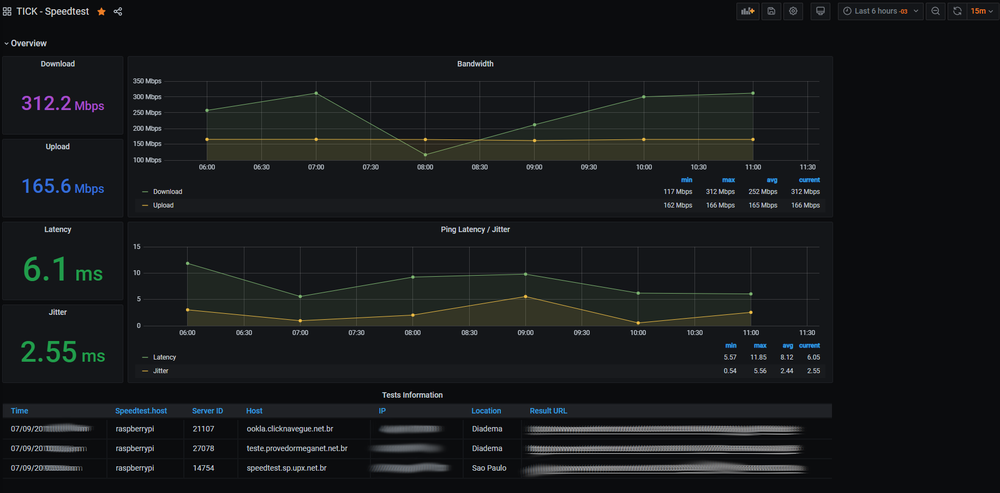

# TICK Speedtest Grafana

Monitor your ISP quality of service with automated periodic speedtests. Visualize download/upload bandwidth, latency, and jitter over time.



## Stack

| Service   | Image                | Purpose                        |
|-----------|----------------------|--------------------------------|
| InfluxDB  | `influxdb:2.9`       | Time-series storage (Flux)     |
| Telegraf  | Custom (Dockerfile)  | Runs speedtest CLI on schedule |
| Grafana   | `grafana/grafana:13.0.2` | Dashboard and visualization |

## Quick Start (Docker Compose)

### Prerequisites

- Docker Engine 24+ and Docker Compose v2
- `openssl` (for random credential generation)

### Deploy

```bash
git clone https://github.com/pedrolsazevedo/TICK-Speedtest-Grafana.git
cd TICK-Speedtest-Grafana
./deploy.sh up
```

This will:
- Generate random passwords and token in `.env` (if not already present)
- Build the Telegraf image and start all services
- Print the generated credentials

Access Grafana at http://localhost:3000 with the credentials shown on first run.

### Management

```bash
./deploy.sh up       # Start/rebuild the stack
./deploy.sh down     # Stop containers
./deploy.sh reset    # Remove volumes + credentials (full reset)
./deploy.sh logs     # Tail all logs
./deploy.sh logs telegraf  # Tail specific service
```

### Manual setup

If you prefer to manage `.env` yourself:

```bash
cp .env.example .env
# Edit .env with your credentials
docker compose up -d --build
```

## Configuration

All settings are in `.env`:

| Variable              | Default           | Description                    |
|-----------------------|-------------------|--------------------------------|
| `INFLUXDB_ADMIN_USER` | `admin`          | InfluxDB admin username        |
| `INFLUXDB_ADMIN_PASSWORD` | (random)     | InfluxDB admin password        |
| `INFLUXDB_ORG`        | `home`           | InfluxDB organization          |
| `INFLUXDB_BUCKET`     | `speedtest`      | InfluxDB bucket name           |
| `INFLUXDB_ADMIN_TOKEN`| (random)         | API token for Telegraf/Grafana |
| `GRAFANA_ADMIN_USER`  | `admin`          | Grafana admin username         |
| `GRAFANA_ADMIN_PASSWORD`| (random)       | Grafana admin password         |
| `SPEEDTEST_INTERVAL`  | `60m`            | How often to run speedtest     |

## Kubernetes (Helm)

A Helm chart is provided in `helm/speedtest-monitor/` using [InfluxDB2](https://github.com/influxdata/helm-charts) and [Grafana](https://github.com/grafana/helm-charts) as subchart dependencies.

### Prerequisites

- Kubernetes cluster (1.26+)
- Helm 3.12+
- Telegraf image built and available to the cluster

### Build and push the Telegraf image

```bash
docker build -t ghcr.io/pedrolsazevedo/speedtest-telegraf:latest ./telegraf
docker push ghcr.io/pedrolsazevedo/speedtest-telegraf:latest
```

For local testing with kind:

```bash
docker build -t ghcr.io/pedrolsazevedo/speedtest-telegraf:latest ./telegraf
kind load docker-image ghcr.io/pedrolsazevedo/speedtest-telegraf:latest --name <cluster-name>
```

### Install

```bash
cd helm/speedtest-monitor
helm dependency update
helm install speedtest . -n monitoring --create-namespace
```

### Override values

```bash
helm install speedtest . -n monitoring --create-namespace \
  --set influxdb2.adminUser.token=$(openssl rand -hex 32) \
  --set influxdb2.adminUser.password=$(openssl rand -base64 18) \
  --set grafana.adminPassword=$(openssl rand -base64 18) \
  --set telegraf.interval=30m
```

Or use a custom `values.yaml`:

```bash
helm install speedtest . -n monitoring --create-namespace -f my-values.yaml
```

### Verify

```bash
kubectl get pods -n monitoring
kubectl logs -n monitoring deployment/speedtest-telegraf
```

### Uninstall

```bash
helm uninstall speedtest -n monitoring
```

## Project Structure

```
.
├── deploy.sh               # Docker management script (auto-generates credentials)
├── docker-compose.yml
├── .env.example
├── telegraf/
│   ├── Dockerfile          # Telegraf 1.38 + Speedtest CLI + EULA acceptance
│   └── telegraf.conf       # InfluxDB v2 output + exec input
├── grafana/
│   ├── dashboards/
│   │   └── speedtest.json  # Auto-provisioned Flux dashboard
│   └── provisioning/
│       ├── dashboards/
│       │   └── default.yml
│       └── datasources/
│           └── influxdb.yml
├── helm/
│   └── speedtest-monitor/
│       ├── Chart.yaml      # Dependencies: influxdb2, grafana
│       ├── values.yaml
│       ├── dashboards/
│       └── templates/
└── config/                 # Legacy configs (kept for reference)
```

## Issues Fixed

This Docker Compose rewrite addresses the following reported issues:

- **#4 — Speedtest link opens about:blank**: Fixed by replacing the deprecated `table-old` panel with a modern `table` panel using data links with `targetBlank: true`.
- **#6 — Telegraf not working (EULA not accepted)**: Fixed by pre-accepting the Speedtest EULA and GDPR consent in the Dockerfile and passing `--accept-license --accept-gdpr` in the command.
- **#7 — No data on dashboard**: Fixed by using InfluxDB 2.x with health checks — Telegraf only starts after InfluxDB is healthy.

## Troubleshooting

### Slow speeds on Raspberry Pi

Add to the host's `/etc/sysctl.conf`:

```
net.core.rmem_max=8388608
net.core.wmem_max=8388608
```

Then `sudo sysctl -p` to apply.

### Checking logs

```bash
./deploy.sh logs telegraf

# Force a speedtest run
docker exec telegraf speedtest --accept-license --accept-gdpr -f json-pretty
```

### Reset everything

```bash
./deploy.sh reset
./deploy.sh up
```

## License

MIT
